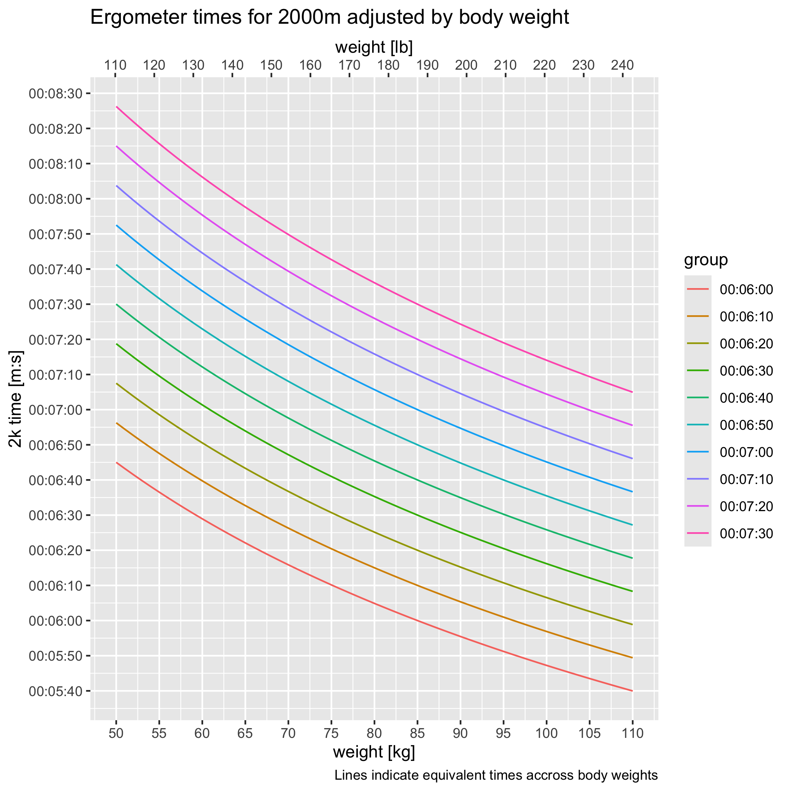

# Weight-adjusted Ergometer Times

In competitive rowing, ergometer tests are used to assess fitness of
athletes and the 2000m test is the standard. The ability to generate
power is dependent on body weight. The exact relation between body
weight and power depends on more factors and the relation to boat speed
is even more complicated: see [Physics of Rowing]. However, the formula
made popular by [C2] is generally accepted as a measure of fitness.

Below is a graph where lines connect points of equal fitness. It is
generated by the R code in this repository.

# Ergonometer Splits

The table below estimates 500m split times for popular distances and
intensity levels. The table shows both absolute 500m splits and splits
relative to the split for a 30 minute at rate 20 ("30R20") workout.
These splits should be considered just a starting point. The estimation
might not be correct and individual physiology varies - some people are
better sprinters than endurance athletes and vice versa. 

|2k     |2k/500 |2k/500|5k     |5k/500 |5k/500|*30R20/500*|UT1/500|UT1/500|UT2/500|UT2/500|
|------:|------:|-----:|------:|------:|-----:|--------:|------:|------:|------:|------:|
|06:00.0|01:30.0|-10.0 |15:59.6|01:36.0|-4.0  |*01:40.0*|01:43.9|3.9    |01:49.8| 9.9   |
|06:05.0|01:31.2|-10.0 |16:12.9|01:37.3|-4.0  |*01:41.3*|01:45.3|4.1    |01:51.4|10.1   |
|06:10.0|01:32.5|-10.1 |16:26.3|01:38.6|-4.0  |*01:42.6*|01:46.8|4.2    |01:52.9|10.3   |
|06:15.0|01:33.8|-10.1 |16:39.6|01:40.0|-3.9  |*01:43.9*|01:48.2|4.3    |01:54.4|10.5   |
|06:20.0|01:35.0|-10.2 |16:52.9|01:41.3|-3.9  |*01:45.2*|01:49.7|4.5    |01:55.9|10.8   |
|06:25.0|01:36.2|-10.2 |17:06.3|01:42.6|-3.8  |*01:46.5*|01:51.1|4.6    |01:57.5|11.0   |
|06:30.0|01:37.5|-10.3 |17:19.6|01:44.0|-3.8  |*01:47.8*|01:52.6|4.8    |01:59.0|11.2   |
|06:35.0|01:38.8|-10.3 |17:32.9|01:45.3|-3.8  |*01:49.1*|01:54.0|4.9    |02:00.5|11.5   |
|06:40.0|01:40.0|-10.3 |17:46.2|01:46.6|-3.7  |*01:50.3*|01:55.4|5.1    |02:02.1|11.7   |
|06:45.0|01:41.2|-10.4 |17:59.6|01:48.0|-3.7  |*01:51.6*|01:56.9|5.3    |02:03.6|11.9   |
|06:50.0|01:42.5|-10.4 |18:12.9|01:49.3|-3.6  |*01:52.9*|01:58.3|5.4    |02:05.1|12.2   |
|06:55.0|01:43.8|-10.5 |18:26.2|01:50.6|-3.6  |*01:54.2*|01:59.8|5.6    |02:06.6|12.4   |
|07:00.0|01:45.0|-10.5 |18:39.6|01:52.0|-3.5  |*01:55.5*|02:01.2|5.7    |02:08.2|12.7   |
|07:05.0|01:46.2|-10.5 |18:52.9|01:53.3|-3.5  |*01:56.8*|02:02.7|5.9    |02:09.7|12.9   |
|07:10.0|01:47.5|-10.6 |19:06.2|01:54.6|-3.4  |*01:58.1*|02:04.1|6.0    |02:11.2|13.2   |
|07:15.0|01:48.8|-10.6 |19:19.5|01:56.0|-3.4  |*01:59.3*|02:05.5|6.2    |02:12.7|13.4   |
|07:20.0|01:50.0|-10.6 |19:32.9|01:57.3|-3.3  |*02:00.6*|02:07.0|6.4    |02:14.3|13.6   |
|07:25.0|01:51.2|-10.7 |19:46.2|01:58.6|-3.3  |*02:01.9*|02:08.4|6.5    |02:15.8|13.9   |
|07:30.0|01:52.5|-10.7 |19:59.5|01:60.0|-3.2  |*02:03.2*|02:09.9|6.7    |02:17.3|14.1   |
|07:35.0|01:53.8|-10.7 |20:12.9|02:01.3|-3.2  |*02:04.5*|02:11.3|6.9    |02:18.8|14.4   |
|07:40.0|01:55.0|-10.7 |20:26.2|02:02.6|-3.1  |*02:05.7*|02:12.8|7.0    |02:20.4|14.6   |
|07:45.0|01:56.2|-10.8 |20:39.5|02:04.0|-3.1  |*02:07.0*|02:14.2|7.2    |02:21.9|14.9   |
|07:50.0|01:57.5|-10.8 |20:52.8|02:05.3|-3.0  |*02:08.3*|02:15.6|7.4    |02:23.4|15.1   |
|07:55.0|01:58.8|-10.8 |21:06.2|02:06.6|-2.9  |*02:09.6*|02:17.1|7.5    |02:24.9|15.4   |
|08:00.0|02:00.0|-10.8 |21:19.5|02:07.9|-2.9  |*02:10.8*|02:18.5|7.7    |02:26.5|15.6   |
|08:05.0|02:01.2|-10.9 |21:32.8|02:09.3|-2.8  |*02:12.1*|02:20.0|7.9    |02:28.0|15.9   |
|08:10.0|02:02.5|-10.9 |21:46.1|02:10.6|-2.8  |*02:13.4*|02:21.4|8.0    |02:29.5|16.1   |
|08:15.0|02:03.8|-10.9 |21:59.5|02:11.9|-2.7  |*02:14.7*|02:22.9|8.2    |02:31.0|16.4   |
|08:20.0|02:05.0|-10.9 |22:12.8|02:13.3|-2.6  |*02:15.9*|02:24.3|8.4    |02:32.6|16.6   |
|08:25.0|02:06.2|-10.9 |22:26.1|02:14.6|-2.6  |*02:17.2*|02:25.7|8.5    |02:34.1|16.9   |
|08:30.0|02:07.5|-11.0 |22:39.5|02:15.9|-2.5  |*02:18.5*|02:27.2|8.7    |02:35.6|17.2   |

[Physics of Rowing]: http://eodg.atm.ox.ac.uk/user/dudhia/rowing/physics/weight.html
[C2]: https://www.concept2.com/indoor-rowers/training/calculators/weight-adjustment-calculator
